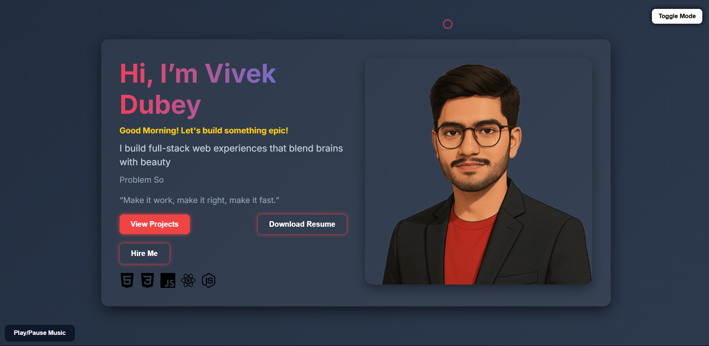

# 🌐 Vivek Dubey - Full Stack Developer Portfolio

Welcome to the source code of my personal developer portfolio website – a creative blend of functionality, aesthetic flair, and tech-stack passion!

This portfolio is a living canvas where I showcase who I am, what I build, and how I bring web ideas to life — all built with ❤️ and code.

## 🔥 Features

- 🎨 **Glassmorphism + Animated Background** – Stylish and modern UI.
- 🌗 **Dark/Light Theme Toggle** – Smooth transition with dynamic theme switcher.
- 🎶 **Background Music** – Chill music toggle for a unique browsing vibe.
- 👋 **Dynamic Greeting** – Time-based greetings for a personal touch.
- ⌨️ **Typing Effect** – Animated text showcasing my skills.
- 💬 **Rotating Quotes** – Inspiring tech quotes on loop.
- 🚀 **Interactive Buttons** – For resume, GitHub projects, and hiring contact.
- 🧠 **Tech Stack Icons** – Hover-enhanced icons for HTML, CSS, JS, React, Node.js.
- 📸 **3D Image Hover Tilt** – Adds movement to my photo section.
- 🖱️ **Custom Cursor** – Glowing cursor for added interactivity.
- 🎬 **Preloader Animation** – Smooth entry animation before the site loads.

## 📸 Preview

> _"I build full-stack web experiences that blend brains with beauty."_

## 🛠️ Tech Stack

- HTML5
- CSS3
- JavaScript (Vanilla)
- AOS Library for scroll animations
- Google Fonts (Inter)
- Simple Icons CDN for Tech Logos

## 🚀 Live Demo

👉 [Click here to explore the live site](https://vivekkk-1.github.io/creative_portfolio/)

## ⚙️ How to Use

1. Clone or download this repo.
2. Make sure your `vivek1.png`, `resume.pdf`, and `music.mp3` files are placed in the root directory.
3. Open `index.html` in your browser. That’s it!

## 💡 Tips

- Replace `"vivek1.png"`, `"music.mp3"` and `"resume.pdf"` with your own media assets.
- Host on GitHub Pages, Netlify, or Vercel for free deployment.

## 📬 Contact

Feel free to connect with me via email: **vivekdubey5960@gmail.com**

## 🙏 Acknowledgments

- Inspired by creative portfolios across the web.
- Thanks to [AOS](https://michalsnik.github.io/aos/) for beautiful scroll animations.
- Font used: [Inter](https://fonts.google.com/specimen/Inter) by Rasmus Andersson.

---

**Made with passion, purpose, and pixels.**

